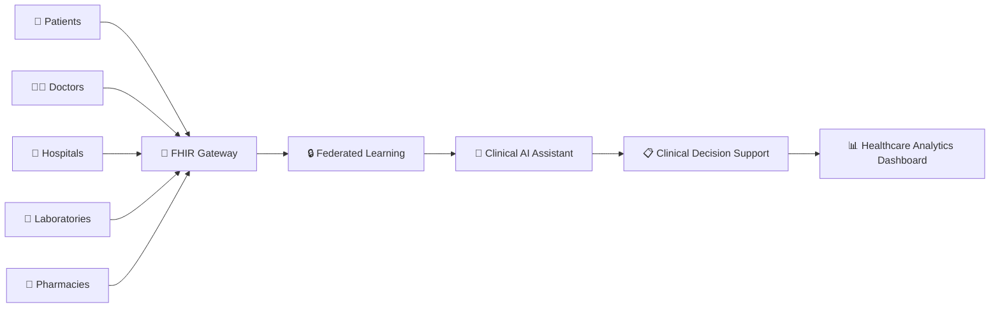
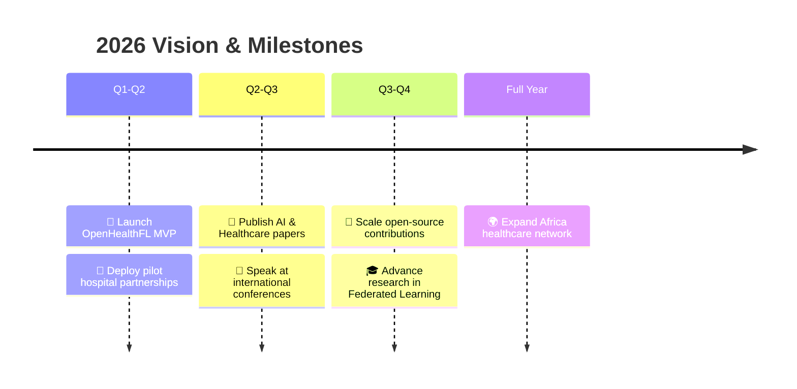

<div align="center">


<br/>

[](https://sethios.me)
[](https://linkedin.com/in/sethiosmomentum)
[](https://x.com/sethios_momentum)
[](mailto:sethiosmomentum@gmail.com)

</div>

<br/>

<div align="center">

> *"Technology becomes truly meaningful when it improves lives."*

</div>

---

<br/>

**Software Engineer • AI Researcher • Digital Health Innovator**

Building **secure, scalable and privacy-preserving AI systems** for Africa's healthcare ecosystem. Passionate about designing complete architectures—from backend infrastructure and cloud systems to intelligent AI models.

| 🧠 Focus Area | 🔬 Research | ⚙️ Engineering | 🌍 Impact |
|:---:|:---:|:---:|:---:|
| Digital Health | Federated Learning | Full Stack Systems | Africa Healthcare |
| AI Systems | Privacy-Preserving AI | Cloud Architectures | Open Source |
| Clinical AI | Medical Imaging | Secure Backend | Health Equity |

---

## 🏥 **Flagship Project: OpenHealthFL**

<div align="center">
  
  
</div>

<br/>

### *An Open Federated AI Framework for Privacy-Preserving Healthcare in Africa.*

OpenHealthFL enables **secure collaboration between hospitals** without exposing sensitive patient data, combining cutting-edge AI with healthcare interoperability standards.



### 🧩 **Core Modules**

| Module | Description | Tech |
|:---|:---|:---|
| 🤖 **AI Clinical Assistant** | Real-time diagnostic support for clinicians | LLMs, NLP, Federated Learning |
| 🏥 **EHR System** | Standards-compliant electronic health records | FHIR, HL7, DICOM |
| 🔒 **Privacy Engine** | Patient data never leaves hospital infrastructure | Differential Privacy, Secure Aggregation |
| 📡 **Telemedicine** | Remote consultation and patient monitoring | WebRTC, Real-time APIs |
| 📊 **Analytics Hub** | Population health insights without compromising privacy | Federated Analytics |

---

## 🛠 **Technology Arsenal**

### 🧬 Core Languages

[](https://python.org)
[](https://typescriptlang.org)
[](https://php.net)
[](https://javascript.com)

### 🎨 Frontend

[](https://react.dev)
[](https://nextjs.org)
[](https://vuejs.org)
[](https://nuxt.com)
[](https://tailwindcss.com)

### ⚙️ Backend

[](https://laravel.com)
[](https://djangoproject.com)
[](https://nodejs.org)
[](https://expressjs.com)

### 🧠 AI & Machine Learning

[](https://tensorflow.org)
[](https://pytorch.org)
[](https://opencv.org)
[](https://scikit-learn.org)

### 🗄️ Data & Storage

[](https://postgresql.org)
[](https://mysql.com)
[](https://mongodb.com)

### ☁️ DevOps & Infrastructure

[](https://docker.com)
[](https://linux.org)
[](https://github.com/features/actions)

---

## 🔬 **Research Domains**

<table>
  <tr>
    <td align="center" width="33%">
      <h4>🔒 Privacy-Preserving AI</h4>
      <p>
        <code>Federated Learning</code><br/>
        <code>Differential Privacy</code><br/>
        <code>Secure Aggregation</code><br/>
        <code>Homomorphic Encryption</code>
      </p>
    </td>
    <td align="center" width="33%">
      <h4>🏥 Healthcare AI</h4>
      <p>
        <code>Medical Imaging</code><br/>
        <code>Clinical Decision Support</code><br/>
        <code>LLMs for Healthcare</code><br/>
        <code>AI Agents & Diagnostics</code>
      </p>
    </td>
    <td align="center" width="33%">
      <h4>🌍 Interoperability</h4>
      <p>
        <code>FHIR Standards</code><br/>
        <code>HL7 Protocols</code><br/>
        <code>DICOM Imaging</code><br/>
        <code>Distributed Systems</code>
      </p>
    </td>
  </tr>
</table>

### 📚 Continuous Learning

<div align="center">
  <code>Large Language Models</code> • <code>Generative AI</code> • <code>AI Agents</code> • <code>Cloud Native Architecture</code> • <code>Kubernetes</code> • <code>Cybersecurity</code> • <code>Explainable AI</code>
</div>

---

## 🎯 **2026 Roadmap**



| 🚀 Product | 📝 Research | 🤝 Community | 🎓 Growth |
|:---:|:---:|:---:|:---:|
| Launch OpenHealthFL | Publish peer-reviewed papers | Major open-source contributions | Advanced AI studies |
| Deploy hospital pilots | Conference presentations | International collaborations | Federated Learning research |
| Scale African solutions | Clinical AI validation | Mentorship & education | Cloud architecture mastery |

---

## 📜 **Certifications**

[]()
[]()
[]()
[]()

---

## 🤝 **Let's Build Together**

<div align="center">

| 💡 Research | 🏥 Healthcare | 🛠 Engineering |
|:---:|:---:|:---:|
| Federated Learning | HealthTech Startups | Full Stack Systems |
| Privacy-Preserving AI | AI for Social Good | Open Source Projects |
| Medical AI Papers | Digital Health Tools | Cloud Infrastructure |

<br/>

### I'm actively seeking collaborations on impactful projects at the intersection of AI and Healthcare.

<br/>

[](https://sethios.me)
[](mailto:sethiosmomentum@gmail.com)

</div>

---

## 📊 **GitHub Analytics**

<div align="center">


<br/>


</div>

---

<div align="center">

<br/>

### ⭐ **Let's build the future of Digital Health together.**

*Consider following my journey or reaching out for collaboration on impactful AI & Healthcare projects across Africa.*

<br/>


</div>
```

